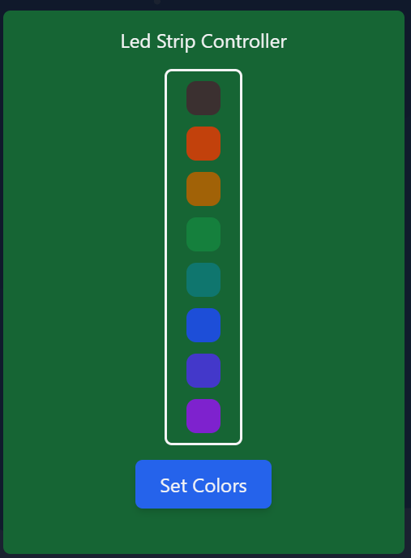

## Christmas Project 2023 🎄

My 2023 Christmas Project, based on NextJs, React and Python 🚀!

### Story 📖

So I wanted to learn a good framework for building full-stack apps. Since I had seen a lot of react apps and liked their feel, look, responsiveness etc. I decided it was time for me to build my first simple web app in an opportunity to learn React, Typescript and how to use the NextJs framework. I also wanted to take a look at Tailwind CSS that I have never used before and as it turns out it is a very very cool way of creating easy CSS.

### What is it 🤔?

So I wanted to build something extremely fun and relatively easy for me to create that I could show to my friends and relatives and make them have a good laugh. My project consists of 3 parts.

1. The music selector. The music selector is a simple web player for playing a range of 5 Christmas songs that you like. (Don't judge my own selections 🤣) Here is a screenshot of this part:


2. Led strip controller. The led strip controller is a simple 8-box selector for setting the lights on a ws2812 8-led rgb strip. Here is a screenshot of that too:



3. Chocolate thrower. This is my favorite one, the chocolate thrower, the idea is simple you have a cup full of sweets tied to a string connected to a servo motor, when you press the button, the servo releases the cup and sweets fall on your desk and your head. Here is a screenshot, of course:


Also here is a screenshot of the entire web app:


### Running 🏃‍♂️

So in order to run this you will need:

- A raspberry Pi (I used a 4)
- A servo motor
- A ws2812 8-led rgb strip

In terms of software:

- Raspberry Pi OS 64bit/32bit
- Python3
- Node18/20

Now you need to connect the servo pwm pin to the 20th pin of the raspberry pi and to the ws2812 data pin to the pin 21 (also connect the power pins 🤣).

When you have the hardware ready connect to your raspberry pi via ssh and clone the repository.

```Bash
git clone https://github.com/steveiliop56/christmas-project.git
cd christmas-project/
```

Now install the npm and pip requirements.

```Bash
npm install
pip3 install -r requirements.txt
```

And last but not least run the project!

```Bash
npm run dev
```

Note: The project runs in development node (I don't know if it works on production mode 😅) so it may take some time to compile the pages depending on the model. On my raspberry pi 4 it took 30 seconds.

Note: Because of the raspberry pi library that controls the led strip, the app needs to run the python script with root in order for the led strip to function.

### Credits

Thanks A LOT to [Nicolas](https://github.com/meienberger) for helping me with the development of this project. It wouldn't have been possible if he didn't tell me what framework to use, how to use React and how to build my API.

### Contributing ❤️

Any contributions to the project are welcome but after Christmas I don't think I will update the project any more.
